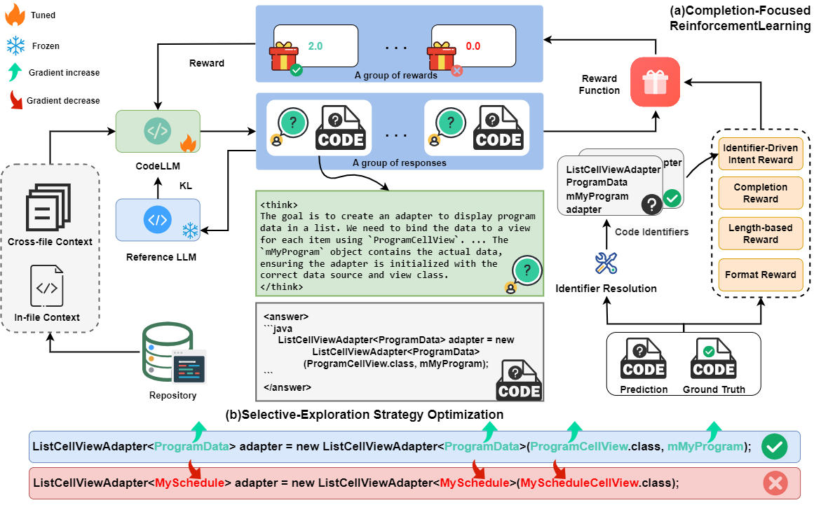
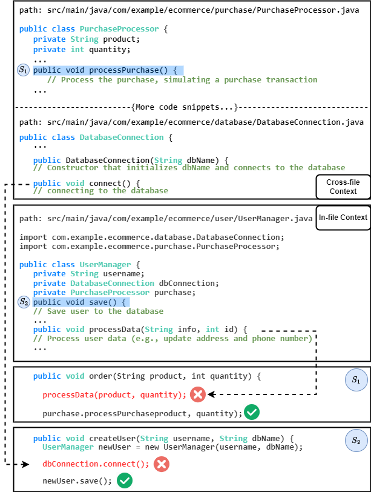
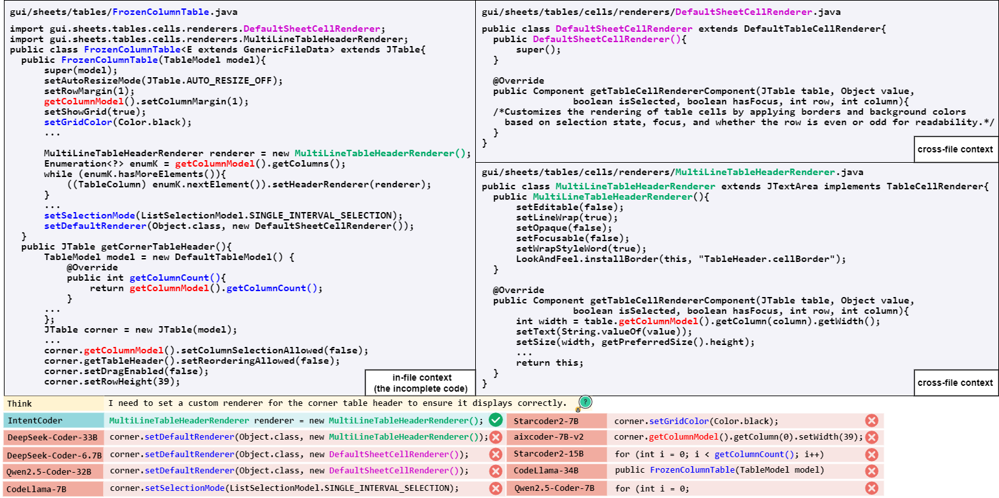

# Towards Effective Repository-Level Code Completion: Reinforcement Learning for In-File and Cross-File Contexts
A reinforcement learning for Repository-Level Code Completion, which imrpoves the model’s code completion ability across multiple scenarios, enhancing its capability to distinguish between cross-file and in-file completion through intent recognition and selective-exploration strategy optimization, making the model applicable to practical completion scenarios.

#### Overview of IntentCoder

Overview of IntentCoder. (a) Illustration of the Completion-Focused Reinforcement Learning process. (b) Illustration of the Selective-Exploration Strategy Optimization.


####  Examples of repository-level code completion

Examples of repository-level code completion. Ex-
amples of repository-level code completion. Situation (1)
reveals that the model gives insufficient consideration to
cross-file context and overly focuses on in-file context, which
results in incorrect completions. Situation (2) demonstrates
that the model’s excessive focus on cross-file context also
leads to errors.


#### Case 

The case study for IntentCoder.

#### Environmental installation
1. eval Environment
Libraries rely on CUDA 12.1. If you see errors related to segmentation faults, double check the version your system is running with `nvcc --version`.

To run the code in this project, first, create a Python virtual environment using e.g. `uv`.
To install `uv`, follow the [UV Installation Guide](https://docs.astral.sh/uv/getting-started/installation/).

```shell
uv venv IntentEnv --python 3.11 && source IntentEnv/bin/activate && uv pip install --upgrade pip
uv pip install tree_sitter==0.20.1 
uv pip install timeout-decorator==0.5.0
uv pip install fuzzywuzzy==0.18.0
uv pip install flashinfer-python
uv pip install cachetools==5.5.2
uv pip install vllm==0.8.3
uv pip install XXX/download/flash_attn-2.7.4.post1+cu12torch2.6cxx11abiFALSE-cp311-cp311-linux_x86_64.whl --no-build-isolation
```
if meet `AttributeError: 'LoRALRUCache' object has no attribute '_LRUCache__update'` when you use vllm=0.8.3
excute `uv pip install cachetools==5.5.2`
- Build tree sitter via `bash evaluation/build_treesitter.sh`

#### process dataset
1. download test data
you should execute the script `script/process_dataset.sh`

2. download and processtrain data
`process_mode` is setting for `process_import_compeltion_dataset`,`process_retrieval_compeltion_dataset` and `merge_import_and_retrieval` one by one.
you should execute the script `script/process_train_dataset.sh`

#### trainning model
After specifying specific parameters (model weight path, language, GPU Settings), you can execute the script `script/train/KL.sh`

#### generation
After specifying specific parameters (model weight path, language, GPU Settings),
you can execute the script `script/generation/inference_intent.sh`
Or you can execute the script `script/generation/inference.sh` by specific Weight of model.

#### eval metric
You can execute the script `script/evaluation/eval_metric.sh` by specific Weight of model.
